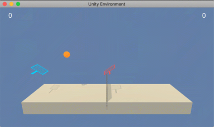

# Project 3

This project was done as part of the Udacity Deep Reinforcement Nanodegree. Some of the text in this README is adapted from the original [Udacity Deep Reinforcement Learning Nanodegree repo](https://github.com/udacity/deep-reinforcement-learning). Read `Report.pdf` for more information.

## Introduction

The environment includes two agents that control rackets that play tennis with each other. An agent receives a reward of 0.1 if it hits the ball over the net. It receives a reward of -0.01 if the ball hits the ground or is out of bounds. The goal is to keep the ball in play.

The observation space for each agent is 8 continuous variables representing the position and velocity of the ball and racket. There are 2 continuous action variables --- moving towards or away from the next and  jumping.

 The solved criteria is an average score of +0.5 over the last 100 consecutive episodes after taking the maximum over both agents.

## Getting Started

1. Make sure you have the following python library dependencies:
    - pytorch
    - numpy
    - unityagents
    - matplotlib
    - jupyter notebook

2. Clone this repository with the command `git clone https://github.com/cjm715/Udacity-drln-p3.git` or simply download as a zip folder by using the green button labeled 'clone or download' on this page. Note that there is no need to separately download the Unity environment. The necessary files are included in the repo.

## Instructions

Run jupyter notebook and open `project3.ipynb`.
